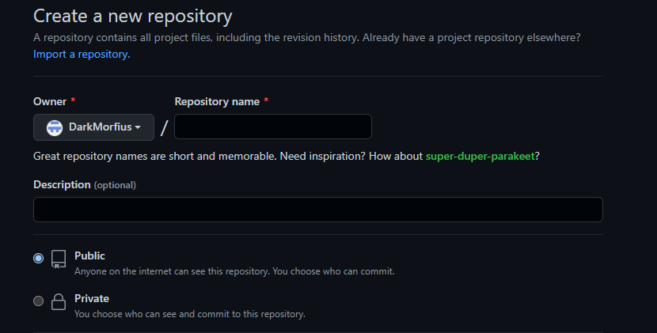

# Конспект.Ссылки. Работа с сайтом GiHub

## разница между git и github

Git
* git - одна из систем контроля версий
* способ организации и поддержания версионности
* самая популярная система контроля

GitHib

* Представляет Microsoft
* Самый популярный сервис * Git
* Много полезных функций
* Огромный архив различного кода

git clone (URL-ссылка) - позволяет скопировать репозиторий из сайта на локальный компьюютер.

cd (change directory) - команда, позволяющая поменять директорию.

## Установка связи.

Для того чтобы установить связь между файлами локального компьютера и GitHub (облако). Необходимо изначально зайти на сайт [GitHub](https://github.com/)
И создать там новый репозиторий. 
 * git remote add origin https://github.com/DarkMorfius/lession3.git
* git branch -M main
* git push -u origin main